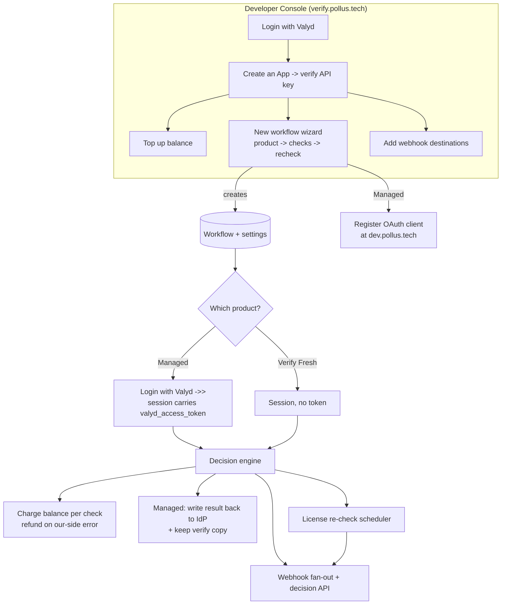
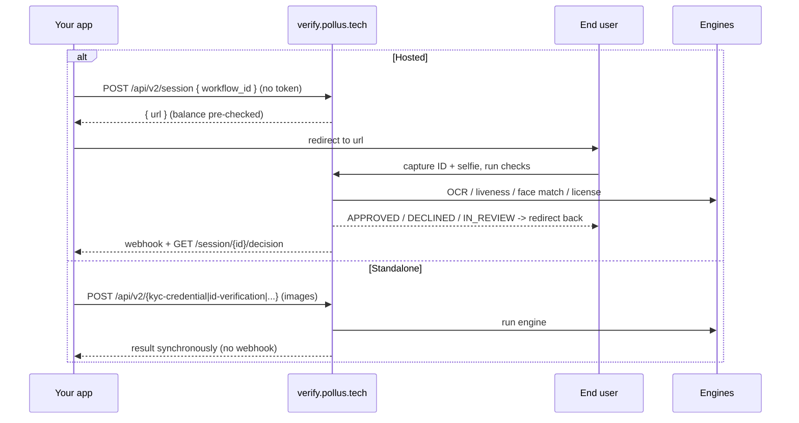
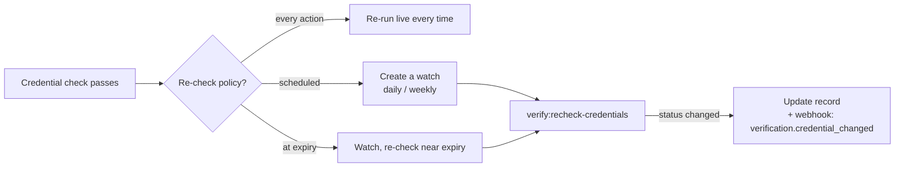

# Valyd Verify — How the whole flow works

A step-by-step map of the product: how a developer sets it up, how an end user gets
verified under each of the two products, and what happens behind the scenes (billing,
webhooks, license re-checks).

---

## 1. The big picture — two products

The first wizard choice changes everything: **does a verified identity persist (Managed —
log in with Valyd, reuse the result), or is every action checked fresh and discarded
(Verify Fresh)?**

| Product | Login | Where checks run | Where results live |
|---------|-------|------------------|--------------------|
| **Managed Identity by Valyd** *(recommended)* | **Your app ↔ the IdP** (TPSSO, your own OAuth client from dev.pollus.tech) | **verify.pollus.tech** | **IdP** (system of record) **+ a verify copy** |
| **Verify Fresh Every Time** | none | verify.pollus.tech | nothing retained |
| Self-Managed Infrastructure | — | — | disabled ("coming soon") |

**Who does what in Managed:**
- **IdP** (`idp.pollus.tech` / `idp.valyd.id`) — authenticates the user ("Login with Valyd")
  and is the **system of record** for the verified identity (`id_verified`, licenses).
- **dev.pollus.tech** — where you register your OAuth client (`client_id`, `client_secret`,
  redirect URIs, scopes) for the login.
- **verify.pollus.tech** — performs the verification work (ID/OCR, liveness, face match, age,
  license registry, location), writes the result back to the IdP, and keeps a copy. Also the
  console/wizard you use to set this up.



---

## 2. How "is this user logged in?" works (Managed)

Your app has **already logged the user in with Valyd** (TPSSO, directly with the IdP), so your
backend holds that user's **Valyd access token**. The hand-off:

1. Your **backend** opens a verify session (`POST /api/v2/session`, authenticated with your
   `X-API-Key`) and **includes the user's Valyd `access_token`** — server-to-server, never in
   a browser URL.
2. verify's backend **validates that token against the IdP**:
   `GET /api/auth/tpsso/userinfo` with `Authorization: Bearer <token>`:
   - **Valid** -> the IdP returns the user (`pollus_id`, `id_verified`, profile). verify
     **binds `pollus_id` to the session** -> proceed with the check.
   - **Missing / invalid / expired** -> verify responds **`HTTP 401 valyd_login_required`**;
     log the user in with Valyd first, then retry.
3. After the check passes, verify records the result against that `pollus_id` on the IdP and
   keeps a verify-side copy.

There is **no in-popup "Continue with Valyd"/OIDC redirect** — login is your TPSSO
integration; verify learns the user from the token you pass.

---

## 3. Developer setup (one time, in the console)

1. **Login with Valyd** at `/dashboard`.
2. **Create an App** -> **verify API key** (shown once, server-side only).
3. **Top up balance** — every check costs credits.
4. **Create a workflow** with the wizard (full page):
   - **Product** — *Managed Identity by Valyd* or *Verify Fresh Every Time*.
   - **Checks** — ID, liveness, face match, age, professional license, location.
   - **Re-check policy** (if a license) — every action / scheduled / at expiry.
   - **Create** -> `workflow_id`.
5. **(Managed)** Register your login OAuth client at **dev.pollus.tech** -> `client_id`,
   `client_secret`, redirect URIs, scopes (`profile`, `verifications`, `doctor_license`, `zkp`).
6. **Add webhook destinations** — one or many; each with its own signing secret + optional
   event filter.

---

## 4. Managed Identity by Valyd — the full flow

```mermaid
sequenceDiagram
    participant U as End user
    participant App as Your app (backend + site)
    participant IDP as idp.pollus.tech
    participant V as verify.pollus.tech

    Note over U,App: 1) Login with Valyd (TPSSO)
    U->>App: click "Login with Valyd"
    App->>IDP: authorize (your client_id + scopes)
    Note over IDP: face/login only if no Valyd session; else silent SSO
    IDP-->>App: redirect back with ?code
    App->>IDP: POST /tpsso/token (client_secret + code)
    IDP-->>App: access_token + user{ pollus_id, id_verified }
    Note over App: store token + pollus_id in your session

    Note over U,App: 2) Verify (carry the token)
    U->>App: click "Verify my license"
    App->>V: POST /api/v2/session { workflow_id, valyd_access_token, vendor_data, redirect_url }
    V->>IDP: GET /tpsso/userinfo (Bearer token) — validate
    alt token valid
        IDP-->>V: pollus_id (bind to session)
        V-->>App: { url }
    else missing / invalid / expired
        V-->>App: 401 valyd_login_required
    end
    App->>U: redirect to url

    Note over U,V: 3) Capture
    alt returning (verified record for this pollus_id)
        U->>V: selfie only
    else first time
        U->>V: full workflow (ID + selfie + ...)
    end
    V->>V: run checks, charge balance, decide

    Note over V,IDP: 4) Write-back + copy
    V->>IDP: record result (id_verified, license) against pollus_id
    V->>V: keep verify copy (cache + audit)
    V-->>U: redirect back to redirect_url
    V-->>App: webhook + GET /session/{id}/decision
```

**In words:**
1. **Login** — user clicks "Login with Valyd"; the IdP authenticates; your backend exchanges
   the code for the access token + `pollus_id` and sets its own session.
2. **Start a check** — your backend calls `POST /api/v2/session` with `X-API-Key`, the
   `workflow_id`, the user's `valyd_access_token`, `vendor_data`, and a `redirect_url`.
3. **Validate + bind** — verify calls `GET /tpsso/userinfo`, confirms login, reads
   `pollus_id`, binds it, returns `{ url }` (or `401 valyd_login_required`).
4. **Capture** — open `url`; first-timers do the full workflow, returning users do
   **selfie only**. Each check deducts its cost (our-side failures auto-refund).
5. **Write-back + copy** — on a pass, verify records the result on the IdP (system of record)
   and keeps its own copy.
6. **Return** — verify redirects to `redirect_url`, sends a signed webhook; you can also pull
   `GET /api/v2/session/{id}/decision`.

### Endpoints involved

**On the IdP (login + validate + write-back):**

| Purpose | Endpoint | Auth |
|---------|----------|------|
| Login authorize (browser) | `GET /api/auth/tpsso/authorize` | IdP session |
| Token exchange (your backend) | `POST /api/auth/tpsso/token` | client_secret |
| Validate token / read `pollus_id` (verify backend) | `GET /api/auth/tpsso/userinfo` | `Bearer <user token>` |
| Read live licenses/verifications (your backend) | `GET /api/auth/tpsso/licenses`, `/verifications` | `Bearer` |
| Write-back result (verify backend) | internal endpoints | shared internal secret |

**On verify (the checks):**
- `POST /api/v2/session` (Managed also accepts `valyd_access_token`) -> `{ url }`
- `GET /api/v2/session/{id}/decision`, webhooks
- `GET /api/v2/identity?vendor_data=|pollus_id=`, `DELETE /api/v2/identity/{pollus_id}`

---

## 5. Verify Fresh Every Time



- **Hosted**: `POST /api/v2/session {workflow_id, redirect_url, callback, vendor_data}` (no
  Valyd token) -> redirect to `url` -> result via webhook + decision API.
- **Standalone**: `/api/v2/{id-verification | liveness | face-match | age-verification |
  credential-verification | kyc-credential | location}` server-to-server, synchronous.

---

## 6. License re-check (keeps a license fresh)



A background job re-runs the registry lookup on the chosen cadence (or near expiry). If a
license lapses or is suspended, it updates the record (Managed: on the IdP + verify copy) and
fires a `verification.credential_changed` webhook.

---

## 7. Billing (per-API credits)

- Each feature has a price; a check **deducts** its cost *before* running.
- Our-side errors (exceptions / unprocessable) **refund automatically**.
- Hosted sessions are **guarded up front**: creating a session checks the balance covers the
  whole workflow (**402 insufficient_balance** otherwise).
- The **Billing** page shows live balance, a top-up modal, and the full ledger. The navbar
  shows a balance pill (amber when low).

---

## 8. Webhooks (multiple destinations)

- Add **one or many** endpoints; each has its own **signing secret** and optional **event
  filter**.
- On a hosted decision (or a license change), the event **fans out** to every active endpoint.
  Standalone calls don't webhook (result is synchronous).
- Verify each request:
  `HMAC-SHA256(timestamp + "." + rawBody, secret)` must equal `X-Valyd-Signature`
  (`X-Valyd-Timestamp` / `X-Valyd-Event-Id` also sent).
- Events: `verification.approved | declined | in_review | expired | abandoned`,
  `verification.credential_changed`.

---

## 9. Console pages at a glance

| Page | What it does |
|------|--------------|
| **Overview** | Session stats + recent verifications |
| **Verifications** | List of sessions and their status |
| **Workflows** | List + the **New workflow wizard** (Managed / Verify Fresh / Self-Managed) -> `workflow_id` |
| **Webhooks** | Add/edit/pause/delete **multiple** destinations + signing secrets |
| **Apps & Keys** | Create apps, view/rotate verify API keys |
| **Billing** | Balance, top-up, transaction history |
| **Settings** | Organization account profile |
